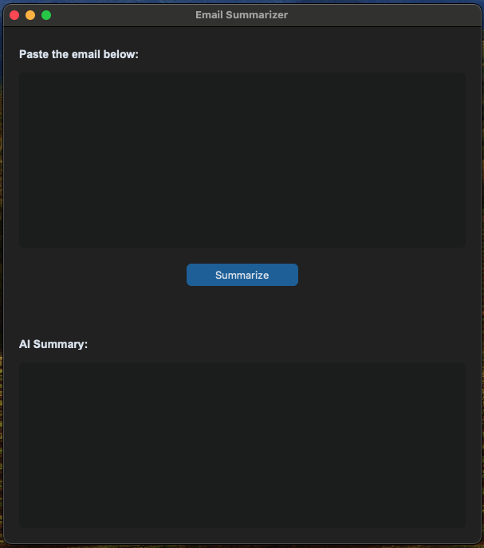
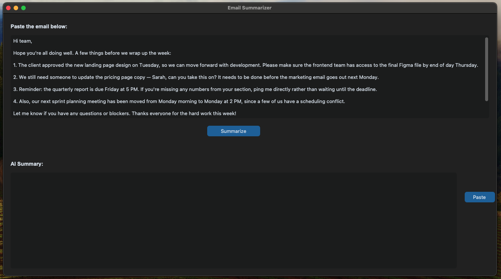
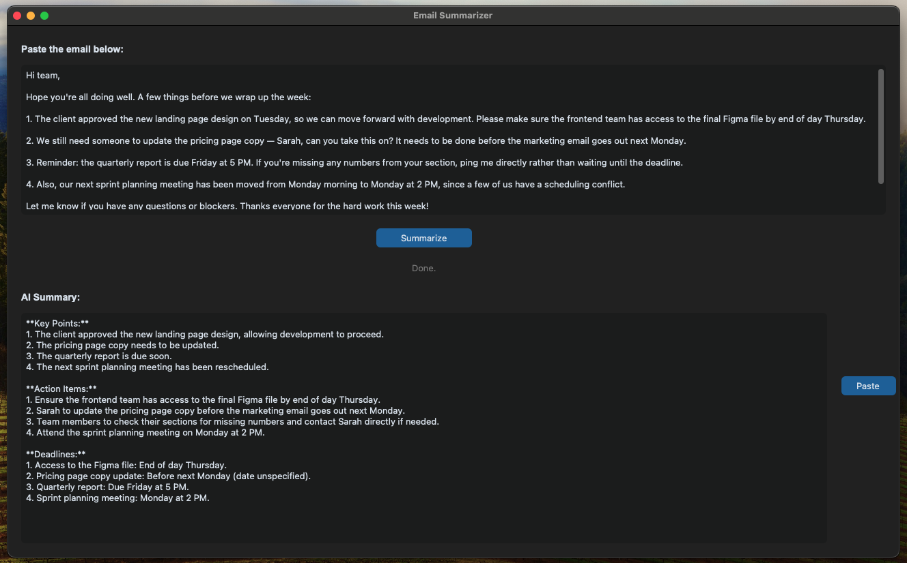

# Email Summarizer

A simple desktop app prototype that lets you paste an email and get an AI-generated summary — key points, action items, and deadlines — using CustomTkinter for the interface and the OpenAI API for the summarization.

## Features

- Paste an email into the input box (manually, or with the **Paste** button to grab it straight from your clipboard)
- Click **Summarize** to send it to the AI and get back a structured summary
- **Copy** button to copy the input text to your clipboard
- Runs as a native desktop window (macOS/Windows/Linux) — no browser required

## Requirements

- Python 3.9+
- An OpenAI API key ([platform.openai.com](https://platform.openai.com))

## Setup

1. **Clone or download this project** to a folder on your computer.

2. **(Recommended) Create a virtual environment**, so this project's libraries don't clash with other projects:
   ```bash
   python -m venv venv
   source venv/bin/activate      # macOS/Linux
   venv\Scripts\activate         # Windows
   ```

3. **Install the required libraries:**
   ```bash
   pip install -r requirements.txt
   ```

4. **Add your API key.** Create a file named `.env` in the project folder with this line:
   ```
   OPENAI_API_KEY=sk-your-actual-key-here
   ```
   > ⚠️ Never commit your `.env` file or share it publicly — it contains a secret key tied to your account.

## Running the app

```bash
python email_summarizer_app.py
```

A window will open. Paste (or type) an email into the top box, click **Summarize**, and the AI's summary will appear in the box below.

## Project structure

```
email-summarizer/
├── email_summarizer_app.py   # Main application (GUI + AI logic)
├── requirements.txt          # Python library dependencies
├── .env                      # Your API key (not committed to git)
├── .gitignore                # Excludes .env and venv/ from git
└── README.md                 # This file
```

## How it works

1. You paste an email into the input textbox.
2. Clicking **Summarize** sends the text, along with instructions, to OpenAI's API.
3. The API call runs on a background thread so the window doesn't freeze while waiting for a response.
4. The AI's summary is written back into the output textbox.

## Notes

- This is a **prototype** — error handling, styling, and packaging are minimal by design, meant for local testing and iteration rather than distribution.
- To share this app with someone who doesn't have Python installed, it would need to be packaged into a standalone executable (e.g. with [PyInstaller](https://pyinstaller.org/)) — not yet set up in this version.
- The AI model used is `gpt-4o-mini`. You can change this in the `_call_openai` method if you'd like to try a different model.

## Pictures







## License

Personal / prototype project — no license specified yet.


